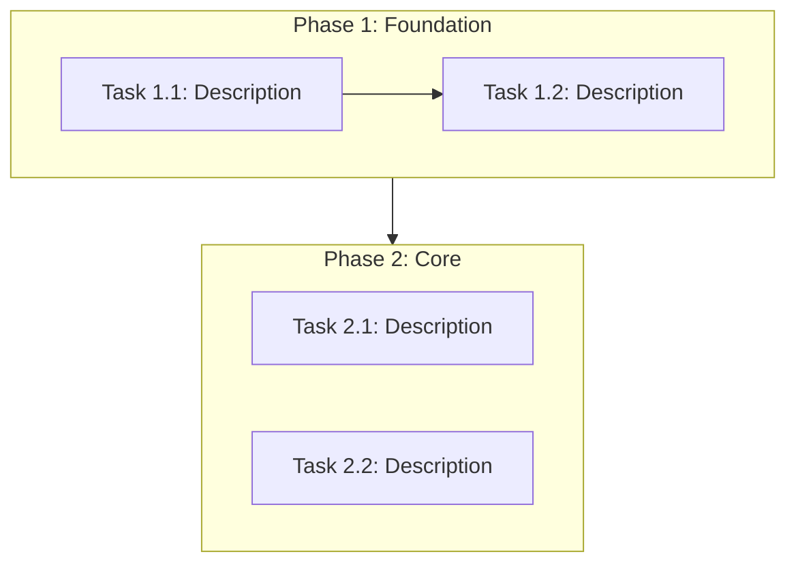

# Plan Document Templates

Templates for the three documents generated in Phase 2 (Task Decomposition). Output to `docs/plan/`.

---

## task-breakdown.md

```markdown
# Task Breakdown

## Overview
- **Total Phases**: N
- **Total Tasks**: N
- **Estimated Total Effort**: S/M/L/XL

## Phase 1: <Phase Name>
**Goal**: What this phase achieves
**Prerequisite**: What must be done before this phase

| # | Task | Priority | Effort | Depends On | Lane | Acceptance Criteria |
|:--|:-----|:---------|:-------|:-----------|:-----|:--------------------|
| 1 |      | P0       | M      | —          | A    |                     |
| 2 |      | P1       | S      | —          | B    |                     |
| 3 |      | P1       | S      | 1          | A    |                     |

### Parallel Lanes
| Lane | Tasks | Combined Effort | Merge Risk | Key Files |
|:-----|:------|:----------------|:-----------|:----------|
| A    | 1, 3  | M               | Low        |           |
| B    | 2     | S               | Low        |           |

> Tasks in different lanes have no mutual dependencies and can be executed simultaneously by separate `task-executor` sub-agents. Merge risk indicates the likelihood of file conflicts between lanes.

## Phase 2: <Phase Name>
<!-- Same structure as Phase 1 -->
```

---

## dependency-graph.md

````markdown
# Task Dependency Graph


````

---

## milestones.md

```markdown
# Milestones

| # | Milestone | Target Phase | Criteria | Status |
|:--|:----------|:-------------|:---------|:-------|
| 1 |           | After Phase 1|          | Pending |
| 2 |           | After Phase 3|          | Pending |
```
